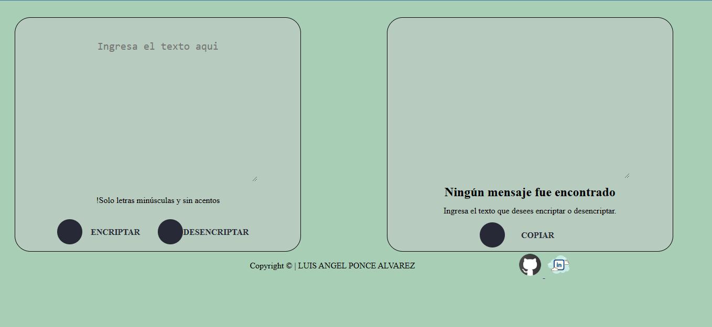

# Text Encrypter | Challenge ONE - Oracle Next Education

Project link below ⬇

---

This is the first Challenge of the ONE - Oracle Next Education program, where we were asked to make a text encrypter, where you can exchange secret messages with other people who know the secret of the encryption used.

---

The encryption "keys" used are the following:

- The letter "e" is converted for `"enter"`
- The letter "i" is converted for `"imes"`
- The letter "a" is converted for `"ai"`
- The letter "o" is converted for `"ober"`
- The letter "u" is converted for `"ufat"`

---

**Requirements:**

- It must work only with lowercase letters.
- Letters with accents and special characters must not be used.
- It must be possible to convert a word to the encrypted version and also return an encrypted word to its original version.

**For example:** `"cat" => "caitober"` `"caitober" => "cat"`

---

**Technologies used:**

---

**Preview:**

---

[**Go to page** ✌](https://luisangelponcealvarez.github.io/challenges-encriptador)
